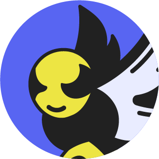

  

# Battles Game
[](https://discord.gg/fPbVS3GNBp)

> Battles Game est utilisé par + 19k utilisateurs sur + 10 serveurs !

Choisissez la stabilité et la puissance, choisissez Battles Game. 🚀

## Caractéristiques

Chaque saison, notre bot propose une bataille amusante pour vos membres ! MAINTENANT : bataille de printemps ! Gagnez des fleures, soignez votre guépe et attaquez les autres membres !

* Facile à utiliser ✌️
* Temps réel 📈
* Système de lootbox 📦
* Rejoins le serveur support et gagne 25 fleurs 📫
* Système de giveaway (admin) 🎉

## Commandes

```
 /embed : Envoyer un embed dans un salon sur le serveur support pour pouvoir voir sont profile, voir le classement et voir les stats du bot. (Renommé le fichier en .txt quand la commande à été utilisé.)
 /fight : Combattre avec un utilisateur pour pouvoir gagner des resource ou en perdre.
 /leaderboard : Voir le classement complet.
 /manage : Pouvoir activer ou désactiver la season sur le serveur. (Pas fonctionnel.)
 /panel : Envoyer un embed dans un salon sur le serveur support pour pouvoir lacer des giveaway. (Renommé le fichier en .txt quand la commande à été utilisé, et faire en sorte que personne ai accès au salon ou l'embed et envoyer.)
 /ping : Voir la lattence du bot.
 /profile : Voir le nombre de vie et de fleurs que l'utilisateur a actuellement.
 /setupembed : Pouvoir faire en sorte que l'utilisateur ai sont propre embed d'explication sur sont propore serveur et que les autre utilisateur puisse voir leur profile.
 /support : Envoie le lien du serveur support de Battles Game et si l'utilisateur rejoins il gagnera 25 fleurs.
 /vote : Pouvoir voter pour le bot avec le système de top.gg qui fera gagner a l'utilisateur 25 fleurs.
```

## Installation

1. Télécharger le répertoire.
2. Avoir [node.js v16](https://nodejs.org/en/blog/release/v16.16.0) d'installer sur votre machine.
3. Allez dans la racine du dossier et exécuter une invite de commande.
4. Taper `npm i` pour installer les modules, puis taper `node sharder.js` pour démarrer le bot.

Si vous avez des erreur au démarrage merci de me contacter sur Discord **koyaimdev#6290** !

### Dépôts :

* **[Battles Game BOT](https://github.com/koyaimdev/battles-game)**
